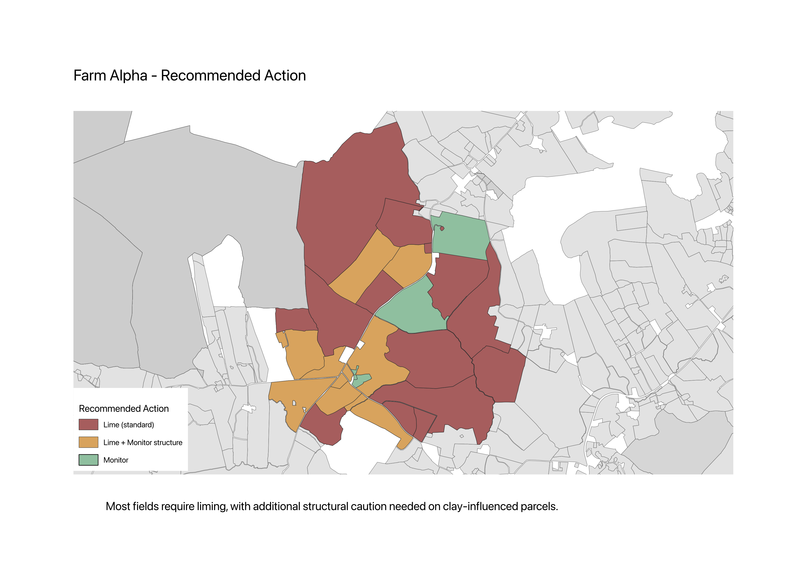

# Farm Alpha — Soil Analysis & Management Recommendations  

## Executive Summary

This project demonstrates how field-boundary and soil data can be transformed into field-level management recommendations through spatial QA, soil summarisation, and map-based decision support.

A subset of Irish LPIS parcels was selected to define Farm Alpha, a coherent analysis unit. SoilGrids data was aggregated to field level and interpreted into clear, actionable outputs.

## Key results:

* Soil pH is consistently low across the farm → whole-farm liming required
* Soil organic carbon (SOC) is moderate to high → generally good soil condition
* Clay-influenced parcels require additional structural caution

These findings were translated into a final Recommended Action Map, showing where intervention is required and where standard management is sufficient.

---

## Project Objective

To build a credible, real-world agritech workflow that moves from:

raw spatial data → validated dataset → field-level summaries → interpretable outputs → actionable recommendations

The focus is not on model complexity, but on:

* data trustworthiness
* clear interpretation
* decision-oriented outputs

---

## Key Outputs

1. Farm Alpha Overview

Defines the selected analysis unit within a larger LPIS dataset.

2. Soil pH Status

Shows that pH is consistently below optimal levels across nearly all fields.

Insight: acidity is a farm-wide constraint, not a localised issue.

---

3. Soil Organic Carbon (SOC) Status

Field-level SOC classification (g/kg).

Insight: SOC is moderate to high, with stronger values in central parcels.

---

4. Recommended Action Map (primary output)

Combines pH status and texture signals into a decision layer:

* Lime + Monitor structure → low pH + clay-influenced fields
* Lime (standard) → low pH, normal structure
* Monitor → near-threshold pH

This map answers: “What should be done, and where?”

---

## Key Findings

* Soil pH is consistently low across the farm, indicating a need for liming at scale
* SOC levels are moderate to high, suggesting generally good organic matter status
* Spatial variation in SOC exists but is not a primary constraint
* Clay-influenced parcels present additional operational risk (drainage, compaction)

---

## Recommended Actions

* Apply lime across all fields to address acidity
* Prioritise structural caution and monitoring on clay-influenced parcels
* Maintain current practices supporting SOC levels

---

## Data Sources

Field Boundaries

* Irish LPIS parcel sample
* Source CRS: EPSG:2157
* Stored in PostGIS as EPSG:4326 (canonical)

Soil Data

* SoilGrids raster layers
* Variables:
    * pH
    * SOC
    * clay
    * sand
* Depth:
    * 0–5 cm

---

## Method Overview 

1. Ingest
    * LPIS parcels loaded into PostGIS
    * Canonical dim_fields table created
2. Spatial QA
    * geometry validity checks
    * overlap detection
    * area outlier analysis
3. Soil Integration
    * SoilGrids layers processed in QGIS
    * zonal statistics applied to field polygons
4. Field-Level Interpretation
    * conversion to readable units
    * creation of:
        * pH_band
        * SOC bands
        * texture_note
5. Decision Layer
    * synthesis of variables into recommended_action

---

## Technical Implementation

* PostgreSQL 17
* PostGIS
* QGIS
* GDAL (ogr2ogr, ogrinfo)
* SQL
* Markdown documentation

Full workflow and SQL scripts are available in:

* sql/
* runbook.md
* docs/qa_*

---

## QA Summary

* Invalid geometries: 0
* Overlapping field pairs: 11 (negligible sliver overlaps)
* Area outliers identified using P01 / P99 thresholds
* Soil summaries successfully generated on a covered subset

---

## Limitations

* SoilGrids provides modelled estimates, not direct sampling
* Only 0–5 cm depth used for v1
* Partial NoData coverage in south-west Ireland
* Soil workflow applied to a subset, not full national coverage
* Outputs are screening-level, not full agronomic prescriptions

---

## Why This Project Matters

This project demonstrates the ability to:

* transform raw spatial data into trustworthy field-level outputs
* apply QA discipline to geospatial datasets
* summarise raster data into operational units (fields)
* produce clear, restrained interpretations
* deliver decision-support artefacts, not just analysis

In essence, it bridges:

data → insight → action

---

## Next Steps / Extensions

* Formalise a mart_field table in Postgres
* Extend soil coverage beyond current subset
* Integrate weather data (rainfall windows, temperature)
* Add NDVI / vegetation signals
* Compare SoilGrids outputs with real soil samples
